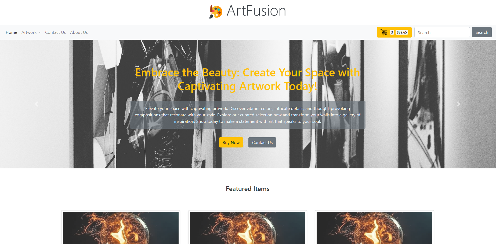

# e-commerece-website

# E-Commerce Website Template



This repository contains a static e-commerce website template that serves as a design blueprint for creating a real online store. The website is built using Bootstrap, custom CSS, and will eventually integrate Python and Flask for dynamic functionality.

## Preview

Here is a preview of the website template:


## Features

- Clean and modern design
- Responsive layout for optimal viewing on various devices
- Bootstrap framework for rapid development
- Custom CSS for unique styling
- Integration with Python and Flask for dynamic functionality (work in progress)

## Getting Started

To get started with the e-commerce website template, follow these steps:

1. Clone the repository:

   ```shell
   git clone https://github.com/Congy91/e-commerece-website
   ```

2. Navigate to the project directory:

   ```shell
   cd your-repo
   ```

3. Open the `index.html` file in your preferred web browser to view the website template.

## Customization

To customize the website template to suit your specific needs, you can modify the HTML, CSS, and image files included in the repository. Here's an overview of the file structure:

- `index.html`: The main HTML file that represents the website's structure.
- `css/`: Directory containing CSS files for styling the website.
- `img/`: Directory containing images used in the website.

Feel free to explore and modify these files according to your requirements.

## Planned Enhancements

We are actively working on integrating Python and Flask to add dynamic functionality to the e-commerce website. Planned enhancements include:

- User registration and authentication
- Product catalog with search and filtering options
- Shopping cart functionality
- Order processing and payment integration

Stay tuned for updates as we continue to develop these features.

## Acknowledgments

We would like to acknowledge the following resources and frameworks that were used in creating this website template:

- [Bootstrap](https://getbootstrap.com/)
- [Font Awesome](https://fontawesome.com/)
- [Unsplash](https://unsplash.com/) (for placeholder images)
